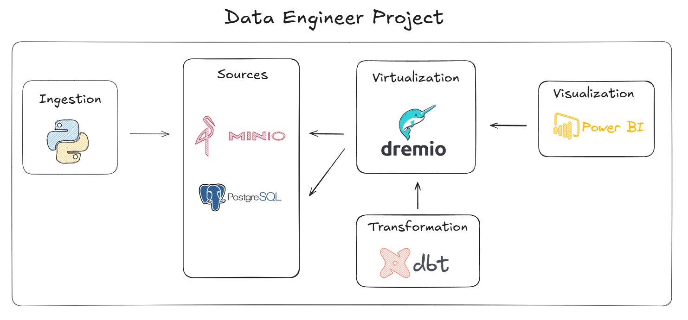
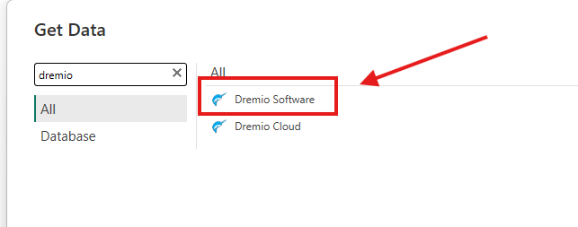

# Dremio Data Virtualization

Esse projeto consiste em simular um ambiente de BigData local onde vamos realizar um processo de ELT. 

## Arquitetura


- A ingestão será feita com Python para o Minio
- O Dremio está virtualizando todos os arquivos do Minio
- O dbt será responsável por processar as camadas inter e mart
- O Power BI vai conectar no Dremio e fazer exibição dos dados.

## Video tutorial
Link: 

## Pré-requisitos
* Docker
* Python 
* Power BI Desktop

## Como instalar o Docker?
https://www.youtube.com/watch?v=pRFzDVn40rw&list=PLbPvnlmz6e_L_3Zw_fGtMcMY0eAOZnN-H

## Como utilizar o projeto?
clone o repositório com o comando:
```
git clone https://github.com/wlcamargo/engineering-python-dbt-dremio-pbi
```
Entre na pasta do projeto:
```
cd engineering-python-dbt-dremio-pbi
```
Crie o ambiente virtual
```
python3 -m venv venv
```
Ative o ambiente virtual
Linux
```
source venv/bin/activate
```
Windows
```
venv/scripts/activate
```
Instale as libs do Python
```
pip install -r requirements.txt
```

## Como subir o serviço do Dremio com o Minio?
Entre na pasta ```docker``` e execute o comando:
```
sudo docker compose up -d
```

## Como rodar a ingestão com Python?
Entre na pasta ```src/pyingestor``` e execute o programa ```main.py```

## Como rodar o processamento com dbt?
Entre na pasta ```src/dbt_dremio``` e execute o programa ```dbt run```

## Como acessar os serviços?

### Minio
```
minio: localhost:9000
login: admin 
senha: password
```

### Dremio
```
dremio: localhost:9047
login: dremio
senha: dremio123
```

### Nessie
```
nessie: localhost: 19120
```

## Como conectar o Power BI ao Dremio?
Busque pelo conector do Dremio 



E use os parâmetros para conectar:
```
localhost:31010
encrypt: disabled
```

## 📚 Referências

https://github.com/dremio/dbt-dremio

https://www.youtube.com/watch?v=rwTYRXm0F58


## 🧑🏼‍🚀 Developer
| Desenvolvedor      | LinkedIn                                   | Email                        | Portfólio                              |
|--------------------|--------------------------------------------|------------------------------|----------------------------------------|
| Wallace Camargo    | [LinkedIn](https://www.linkedin.com/in/wallace-camargo-35b615171/) | wallacecpdg@gmail.com        | [Portfólio](https://wlcamargo.github.io/)   |